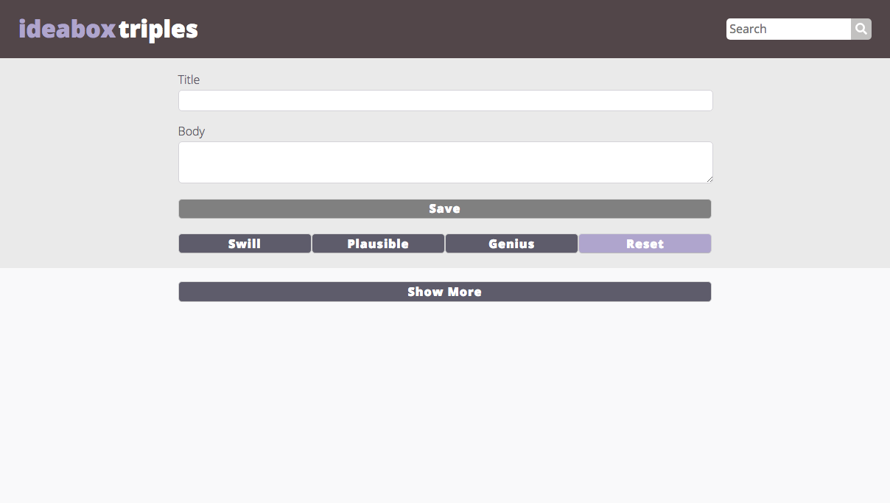
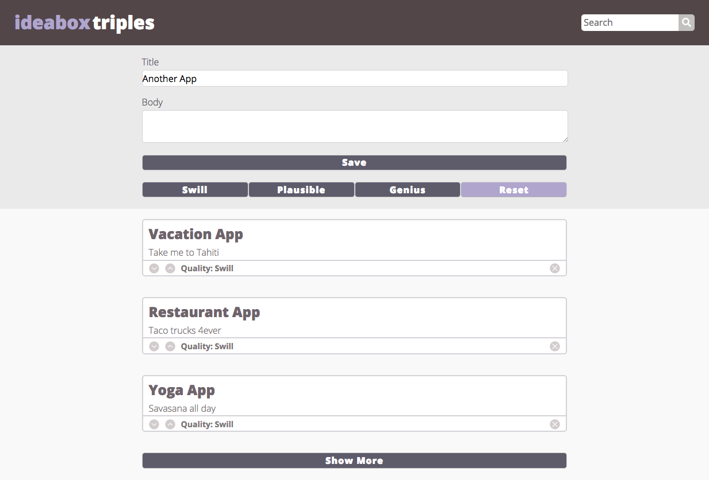
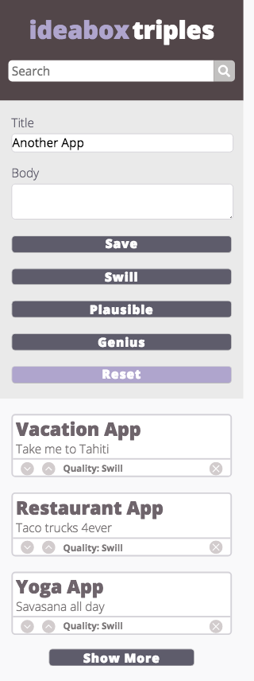

# Ideabox Triples

This is a web application designed to store a user's ideas. An idea is made up a title, a body, and a quality value, all of which are created and stored locally within a separate class. The localStorage objects are retrieved and placed on the DOM accordingly. 

Main funcationality includes: Creating and deleting ideas, manipulating the quality value, and filtering ideas via both a search and quality function. 

The Ideabox application is supported on mobile devices up to 320px wide. 

## Desktop Version

## Mobile Version

## Original Comp

